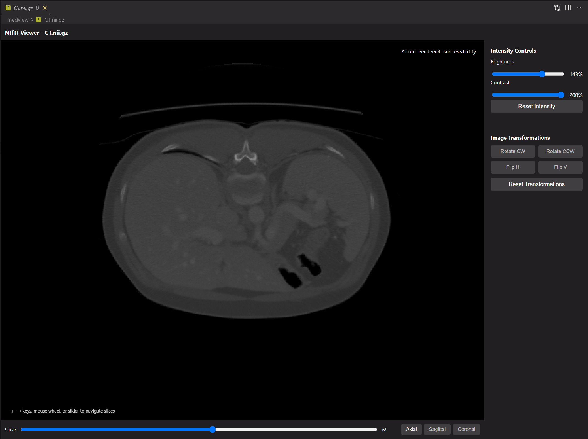
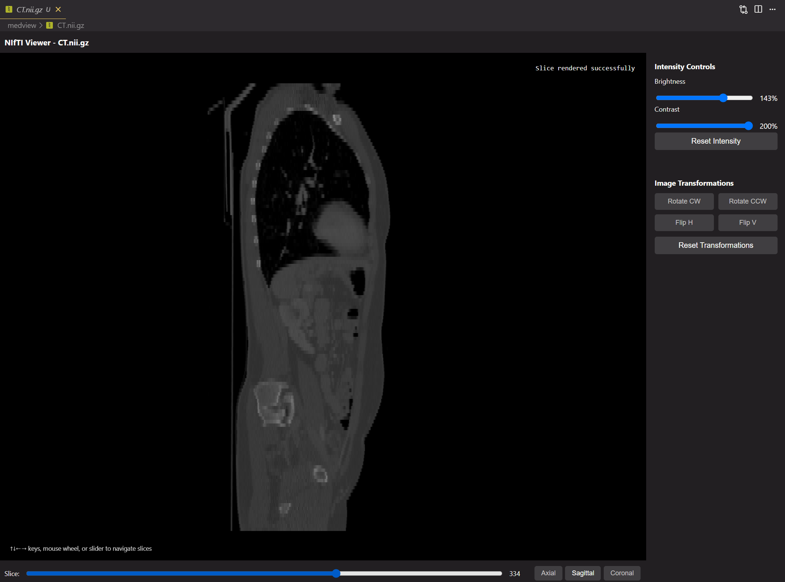
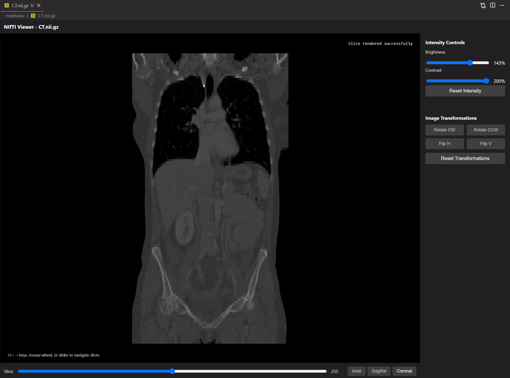

# MedViews

A powerful NIfTI (.nii, .nii.gz) and DICOM (.dcm) medical image viewer for Visual Studio Code and Cursor IDE.

## 🏥 Purpose

MedViews brings professional medical imaging capabilities directly into your code editor. Whether you're a researcher, developer, or medical professional working with neuroimaging data, this extension provides a comprehensive medical image viewer supporting both NIfTI and DICOM formats with all the essential tools for medical image analysis.

## ✨ Features

### 🔍 Multi-Planar Reconstruction
View your medical images in all three anatomical planes:

| Axial View | Sagittal View | Frontal View |
|------------|---------------|--------------|
|  |  |  |

### 🎛️ Advanced Image Controls
- **Brightness & Contrast**: Fine-tune image intensity for optimal visualization
- **Image Transformations**: Rotate (clockwise/counterclockwise) and flip (horizontal/vertical)
- **Navigation**: 
  - Keyboard shortcuts (arrow keys, Page Up/Down, Home/End)
  - Mouse wheel scrolling
  - Interactive slice slider
- **Real-time Updates**: All changes are applied instantly with smooth GPU-accelerated rendering

### 🖼️ Professional Medical Imaging Features
- **Multi-Format Support**: Handles both NIfTI (.nii, .nii.gz) and DICOM (.dcm) formats
- **Native Resolution Display**: Maintains original image quality without interpolation
- **Physical Aspect Ratio**: Respects voxel spacing for accurate anatomical proportions
- **Global Intensity Normalization**: Consistent brightness across all slices
- **Compressed File Support**: Handles both .nii and .nii.gz formats seamlessly
- **Memory Efficient**: Smart caching and lazy loading for large datasets
- **DICOM Single-Slice Viewing**: Optimized interface for DICOM files with simplified controls

## 📦 Installation

### Visual Studio Code
1. Open VS Code
2. Go to Extensions (`Ctrl+Shift+X` or `Cmd+Shift+X`)
3. Search for "MedViews"
4. Click "Install"

### Cursor IDE
1. Open Cursor
2. Go to Extensions (`Ctrl+Shift+X` or `Cmd+Shift+X`)
3. Search for "MedViews"
4. Click "Install"

### Manual Installation
1. Download the `.vsix` file from the releases
2. Open VS Code/Cursor
3. Run `Extensions: Install from VSIX...` from the Command Palette
4. Select the downloaded file

## 🚀 Getting Started

### After Installation
MedViews automatically registers as the default viewer for NIfTI and DICOM files. If you need to manually set it:

1. Right-click on any `.nii`, `.nii.gz`, or `.dcm` file
2. Select "Open With..."
3. Choose "MedViews Medical Image Viewer"
4. Check "Configure default editor" to make it permanent

### First Use
Simply open any NIfTI or DICOM file in your workspace - MedViews will automatically launch and begin loading your medical image data.

## 🎮 Usage Guide

### Navigation Controls
- **Arrow Keys**: Navigate between slices
- **Mouse Wheel**: Scroll through slices when hovering over the image
- **Slice Slider**: Click and drag for precise slice selection
- **Page Up/Down**: Jump 10 slices at a time
- **Home/End**: Jump to first/last slice

### View Controls
- **Anatomical Planes** (NIfTI only): Click the icon buttons to switch between Axial, Sagittal, and Coronal views
- **Brightness/Contrast**: Use the sliders in the right panel to adjust image intensity
- **Reset Intensity**: Restore default brightness and contrast settings
- **DICOM Files**: Display in single-slice axial view with simplified controls

### Image Transformations
- **Rotate CW/CCW**: Rotate the image 90 degrees clockwise or counterclockwise
- **Flip H/V**: Flip the image horizontally or vertically
- **Reset Transformations**: Restore original image orientation

### Keyboard Shortcuts
| Key | Action |
|-----|--------|
| `↑` `↓` `←` `→` | Navigate slices |
| `Page Up` / `Page Down` | Jump 10 slices |
| `Home` / `End` | First/Last slice |
| `Mouse Wheel` | Scroll through slices |

## 🔧 Technical Specifications

- **Supported Formats**: NIfTI (.nii, .nii.gz) and DICOM (.dcm)
- **Data Types**: All standard NIfTI data types (8-bit, 16-bit, 32-bit, float, double) and DICOM pixel data
- **Compression**: Automatic decompression of .gz files
- **Performance**: GPU-accelerated rendering with optimized memory usage
- **Compatibility**: VS Code 1.60+ and Cursor IDE

## 🐛 Troubleshooting

### Common Issues
**Q: Medical image files don't open with MedViews automatically**
A: Right-click the file → "Open With..." → "MedViews Medical Image Viewer" → Check "Configure default editor"

**Q: Images appear distorted or stretched**
A: MedViews automatically applies correct aspect ratios based on voxel spacing. If issues persist, check your file's header information.

**Q: Large files load slowly**
A: MedViews uses progressive loading. Header information loads first, followed by image data in the background.

**Q: DICOM files show limited controls**
A: DICOM files are single-slice images, so multi-planar reconstruction controls are hidden. Use brightness/contrast and transformation controls for optimal viewing.

## 🤝 Contributing

We welcome contributions! Please feel free to:
- Report bugs and feature requests
- Submit pull requests
- Share feedback and suggestions

## 📄 License

This extension is released under the MIT License. See the LICENSE file for details.

## 🙏 Acknowledgments

- Built with the NIfTI JavaScript library and custom DICOM parser
- Optimized for medical imaging workflows
- Designed for researchers and medical professionals

---

**Made with ❤️ for the medical imaging community**
